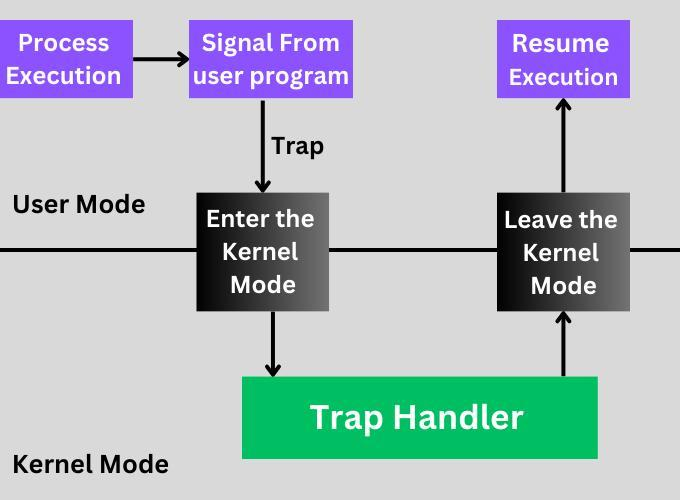
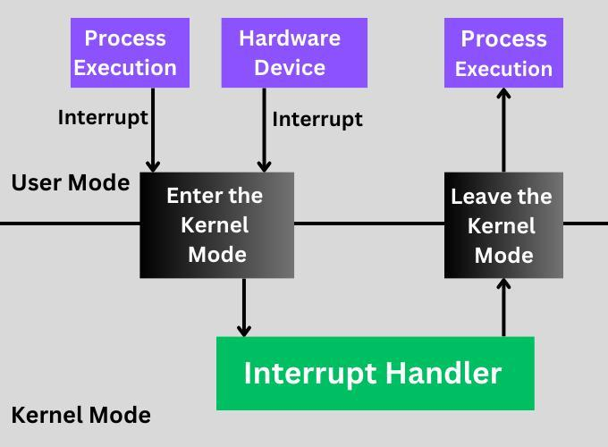

# Tipos de Kernel

## Kernel Monolítico

Con este tipo de arquitectura de sistema, todo el sistema operativo, incluida la funcionalidad principal, los controladores de dispositivos, la administración del sistema de archivos y las pilas de red, se ejecuta en un único espacio de memoria, lo que ofrece alta eficiencia y acceso directo a los recursos de hardware.

### Ventajas

- Alto rendimiento debido a que se ejecuta en un único espacio de direcciones.
- Comunicación eficiente entre procesos.
- Acceso directo y rápido a los recursos de hardware.
- Amplio soporte para hardware y dispositivos debido a un desarrollo maduro.
- Conjunto completo de funciones integradas en el kernel.

### Desventajas

- Complejidad en el mantenimiento y actualización del código del kernel.
- Mayor potencial de fallos del sistema y vulnerabilidades de seguridad.
- Es difícil aislar los componentes defectuosos, lo que afecta la estabilidad del sistema.
- Los tamaños de granos más grandes pueden generar ineficiencias.
- Las actualizaciones o cambios modulares pueden requerir reinicios completos del sistema.

## Microkernel

Este tipo de kernel solo incluye los servicios más fundamentales del sistema, como la comunicación entre procesos y la administración básica de hardware, con otros servicios que se ejecutan en el espacio del usuario para mejorar la modularidad y la seguridad del sistema.

### Ventajas

- Seguridad y estabilidad mejoradas debido al aislamiento de los componentes del sistema.
- Más fácil de mantener y actualizar componentes individuales sin afectar a todo el sistema.
- Mayor flexibilidad en términos de reemplazo o modificación de componentes.
- Adecuado para uso en sistemas que requieren alta confiabilidad y disponibilidad.
- El diseño simplificado genera menos errores y vulnerabilidades.

### Desventajas

- Menor rendimiento en comparación con los núcleos monolíticos debido a la sobrecarga de la comunicación entre procesos.
- Arquitectura de sistema más compleja, que puede complicar el desarrollo y la depuración.
- Potencial de aumento de la latencia de las llamadas al sistema, lo que afectará a las aplicaciones urgentes.
- El desarrollo y la optimización pueden requerir más esfuerzo y experiencia.
- Soporte limitado para hardware y software heredado en comparación con algunos núcleos monolíticos.

## Kernel Híbrido

Una arquitectura de sistema de kernel híbrido combina los elementos de monolíticos y microkernels, ejecutando algunos servicios en el espacio del kernel para mejorar el rendimiento mientras mantiene otros en el espacio del usuario para una mejor modularidad y seguridad.

### Ventajas

- Rendimiento eficiente en muchos escenarios.
- Capacidad para ejecutar servicios de usuario y controladores en el espacio del usuario o en el espacio del kernel.
- Mejor compatibilidad de hardware y aplicaciones.
- Estabilidad y seguridad del sistema mejoradas en comparación con los núcleos monolíticos.
- El diseño modular facilita las actualizaciones y el mantenimiento de determinados componentes.

### Desventajas

- Más complejos de diseñar e implementar que los monolíticos o los microkernels.
- Potencial de aumento de la sobrecarga del sistema y de la latencia en la comunicación entre el espacio del usuario y el espacio del kernel.
- Riesgos de seguridad si los servicios del espacio del usuario interactúan estrechamente con los servicios del kernel.
- Puede heredar las desventajas de las arquitecturas monolíticas y de microkernel, según la implementación.
- Un compromiso entre rendimiento y modularidad puede generar ineficiencias.

## Exokernel

Este tipo de kernel permite que las aplicaciones tengan un acceso más directo a los recursos de hardware al minimizar el papel del kernel en la gestión de recursos. Este enfoque reduce la sobrecarga de la capa de abstracción y proporciona más flexibilidad y eficiencia en cómo las aplicaciones interactúan con el hardware del sistema.

### Ventajas

- Rendimiento mejorado debido a menos abstracción y gastos generales.
- Mayor flexibilidad para que las aplicaciones optimicen el uso de recursos.
- Permite optimizaciones y personalizaciones específicas de la aplicación.
- Fomenta la innovación al permitir nuevas estructuras de sistemas operativos.
- Multiplexación eficiente de recursos de hardware entre múltiples entornos.

### Desventajas

- Mayor complejidad en el desarrollo de aplicaciones.
- Riesgos de seguridad potencialmente mayores debido a que las aplicaciones tienen un acceso más cercano al hardware.
- Problemas de compatibilidad entre aplicaciones diseñadas para diferentes sistemas basados en exokernel.
- Menos aislamiento entre aplicaciones, lo que podría provocar problemas de estabilidad.

# Modo Kernel vs Modo Usuario

El **Modo Kernel** y el **Modo Usuario** representan dos estados operativos distintos dentro de un sistema informático, cada uno con su propio nivel de acceso y control sobre los recursos de hardware.

## Modo Kernel

También conocido como **modo supervisor**, este modo otorga al kernel acceso completo a todo el hardware y la memoria del sistema.

### Características del Modo Kernel

- **Acceso Completo al Hardware y Memoria**: Permite que el kernel realice tareas críticas de bajo nivel, como:
  - Administración de memoria.
  - Ejecución de instrucciones de hardware.
  - Manejo de interrupciones.

- **Alto Nivel de Confianza y Autoridad**: El código que se ejecuta en modo kernel puede interactuar y controlar directamente el hardware, lo que es esencial para una gestión eficiente del sistema.

### Riesgos del Modo Kernel

- **Vulnerabilidad a Errores y Fallos de Seguridad**: Debido al acceso sin restricciones:
  - Cualquier error puede provocar inestabilidad significativa del sistema.
  - Las vulnerabilidades de seguridad pueden ser explotadas para comprometer todo el sistema.

## Modo Usuario

Este es un modo restringido en el que se ejecutan la mayoría de las aplicaciones y software del sistema.

### Características del Modo Usuario

- **Acceso Restringido al Hardware**: 
  - El acceso a recursos críticos está mediado por el kernel a través de **llamadas al sistema**.
  - Las aplicaciones no pueden interactuar directamente con el hardware.

- **Entorno Protegido**:
  - Proporciona seguridad al limitar lo que las aplicaciones pueden hacer, protegiendo el sistema contra software malicioso o defectuoso.
  - Facilita la estabilidad del sistema al aislar errores dentro de aplicaciones individuales.

### Ventajas del Modo Usuario

- **Mejora de la Estabilidad del Sistema**:
  - Si una aplicación falla, es menos probable que cause una falla generalizada.
  - El kernel puede gestionar y aislar problemas de manera efectiva.

- **Seguridad Aumentada**:
  - Reduce el riesgo de que software malicioso afecte críticamente al sistema.
  - Control estricto sobre qué operaciones pueden realizar las aplicaciones.

La separación entre los modos de usuario y kernel es fundamental para los sistemas operativos modernos, ya que proporciona un límite de seguridad y garantiza la estabilidad. El sistema operativo controla cuidadosamente la transición del modo de usuario al modo kernel y viceversa, lo que permite un equilibrio entre el rendimiento y la seguridad del sistema.

# Diferencias entre Trap e Interrupción en Sistemas Operativos

Las traps e interrupciones son dos tipos de eventos en un sistema operativo. Una trap es activada por una aplicación de usuario, mientras que una interrupción es generada por un dispositivo de hardware como un teclado, temporizador u otro dispositivo. El control es transferido a un manejador de trap en el caso de una trap, y a un manejador de interrupciones en el caso de una interrupción. Después de ejecutar el manejador, el control regresa al programa original.

## ¿Qué es una Trap?

Una trap es una interrupción síncrona que es activada por una excepción en un proceso de usuario para permitir la ejecución de una funcionalidad específica. Puede ser provocada por situaciones como acceso indebido a la memoria, división por cero o un breakpoint.

### Funcionamiento de una Trap

- **Generación de la trap:** Errores o excepciones como división por cero, acceso a memoria inválida o una instrucción inválida pueden generar una trap.
- **Cambio a modo kernel:** El CPU entra en modo kernel y transfiere el control al manejador de trap.
- **Acción del manejador de trap:** El manejador de trap determina la causa de la trap y realiza la acción adecuada, como terminar la aplicación o informar al usuario de un error.
- **Retorno al programa:** Después de completar su tarea, el manejador devuelve el control al programa que generó la trap, y el CPU regresa al modo usuario.

### Ejemplo de Trap

Supongamos que tienes una instrucción como `printf("%s\n", str);`. Esto llamará a la función `write` para imprimir la salida en la pantalla. Esto activará una trap que enviará el control al manejador de trap. El modo usuario cambia al modo kernel, y el sistema operativo ejecuta la llamada `write`. Tras completar la tarea, el control regresa del modo kernel al modo usuario.

<!--  -->

  

## ¿Qué es una Interrupción?

Una interrupción es generada por un dispositivo de hardware, como teclados, tarjetas NIC, o dispositivos USB. Las interrupciones son asíncronas, lo que significa que pueden ocurrir en cualquier momento.

### Funcionamiento de una Interrupción

- **Generación de la interrupción:** Un dispositivo de hardware externo genera una señal de interrupción para notificar al CPU que se debe realizar una acción.
- **Cambio a modo kernel:** El CPU suspende la ejecución del programa actual y entra en modo kernel para que el sistema operativo pueda manejar la interrupción.
- **Manejador de interrupciones:** El sistema operativo invoca su manejador de interrupciones para gestionar la interrupción, determinando su causa y respondiendo adecuadamente, como leyendo datos del dispositivo.
- **Retorno al programa:** Después de gestionar la interrupción, el programa interrumpido reanuda su ejecución en el punto donde fue suspendido.

### Ejemplo de Interrupción

Cuando se presiona una tecla, se genera una interrupción. El CPU cambia del proceso actual a la rutina del manejador de interrupciones del teclado. Tras completar el código del manejador de interrupciones, el CPU regresa al programa original que estaba ejecutando.

<!--  -->

  

