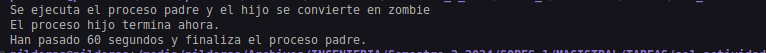
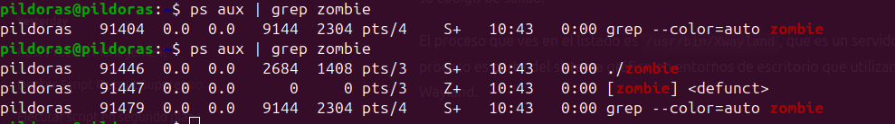

# Actividad 6 - Procesos e Hilos

1. ¿Incluyendo el proceso inicial, cuantos procesos son creados por el siguiente programa?

    ```c
    #include <stdio.h>
    #include <unistd.h>

    int main() {
      fork();

      fork();

      fork();

      return 0;
    }
    ```
    En el programa se crearon 8 procesos.


    - El proceso inicial o proceso padre.
    - Después del primer fork: 2 procesos (padre + 1 hijo). Ambos procesos (el padre y el hijo) continúan ejecutando la segunda llamada a fork.
    - Después del segundo fork: Tanto el proceso padre como el proceso hijo ejecutan este fork, lo que significa que cada uno de ellos crea un nuevo proceso hijo. Ahora son 4 procesos.
    - Después del tercer fork: Todos los 4 procesos (el padre y los 3 hijos) ejecutan este fork, por lo que cada uno genera un nuevo hijo. Creando 8 procesos.

2. Utilizando un sistema Linux, escriba un programa en C que cree un proceso hijo (fork) que finalmente se convierta en un proceso zombie. Este proceso zombie debe permanecer en el sistema durante al menos 60 segundos.

    ```c
    #include <stdio.h>
    #include <stdlib.h>
    #include <unistd.h>

    int main()
    {
        pid_t pid = fork(); // Crear un proceso hijo

        if (pid == 0)
        {
            // Este es el proceso hijo
            printf("El proceso hijo termina ahora.\n");
            exit(0); // El proceso hijo termina aquí
        }
        else
        {
            // Este es el proceso padre
            printf("Se ejecuta el proceso padre y el hijo se convierte en zombie\n");

            // Esperar 60 segundos antes de terminar
            sleep(60);

            printf("Han pasado 60 segundos y finaliza el proceso padre.\n");
        }

        return 0;
    }
    ```

    - Compilar el programa con el siguiente comando:
        ```bash
        gcc -o zombie zombie.c
        ```

    - Ejecutar el programa con el siguiente comando:
        ```bash
        ./zombie
        ```

    - Para verificar que el proceso hijo se convirtió en un proceso zombie, se pueden utilizar los siguientes comandos:
        ```bash
        ps aux | grep zombie
        ps aux | grep Z
        ```




3. Usando el siguiente código como referencia, completar el programa para que sea
ejecutable y responder las siguientes preguntas:

    ```c
    pid_t pid;

    pid = fork();
    if (pid == 0) {
      fork(); {/* child process */}
      thread_create(...);
    }
    fork();
    ```
    - ¿Cuántos procesos únicos son creados?

        Se crean 6 procesos únicos.

        - Proceso original.
        - Primer fork: Crea 1 proceso hijo (proceso original + 1 hijo).
        - Segundo fork dentro del hijo del primer fork: Crea 1 proceso adicional (proceso original + 2 hijos).
        - Segundo fork: Duplica los procesos actuales resultando en 6 procesos en total.


    - ¿Cuántos hilos únicos son creados?

        Solamente se crea 1 hilo. El cual es creado por el proceso hijo del primer fork que se encuentra dentro de la condición if.

